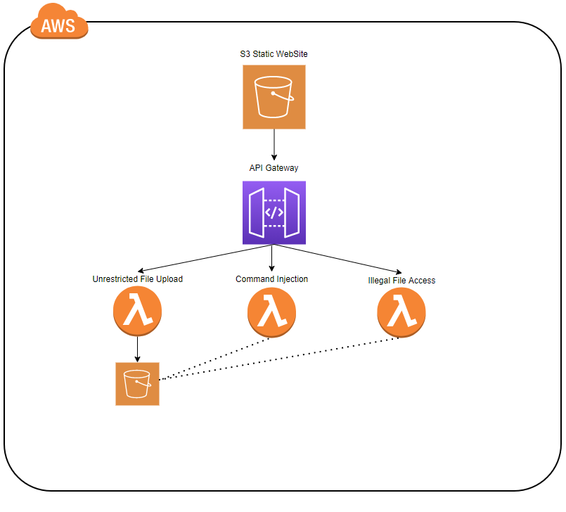

# vulnerable-serverless-application-python
Simple Serverless Application with a few weakness to exploit

## Note to Delete Stack
In order to successfully delete this CloudFormation stack, you must first delete the all objects uploaded to S3 

